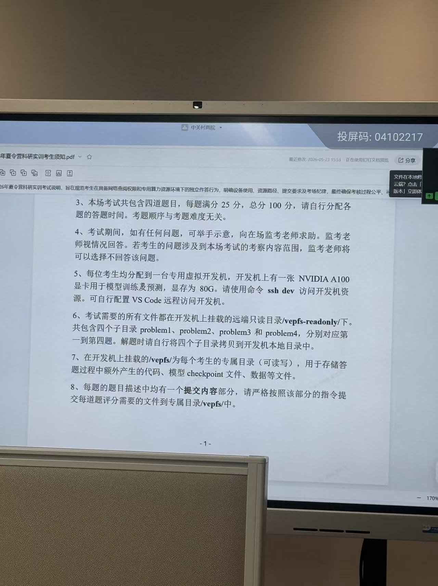

# 明天考试任务要求摘录

原图归档：

```text
assets/task-requirements-2026-05-23.jpg
```



## 关键信息

这张图来自考试说明第一页，主要包含第 3 到第 8 条要求。

### 题目与分数

```text
本场考试共包含四道题目，每题满分 25 分，总分 100 分。
请自行分配各题答题时间。
考题顺序与考题难度无关。
```

### 求助方式

```text
考试期间如有任何问题，可以举手示意，向在场监考老师求助。
监考老师视情况回答。
如果问题涉及本场考试的考察内容范围，监考老师可以选择不回答。
```

### 开发机与 GPU

```text
每位考生分配到一台专用虚拟开发机。
开发机上有一张 NVIDIA A100 显卡，用于模型训练及预测。
显存为 80G。
使用命令 ssh dev 访问开发机资源。
可以自行配置 VS Code 远程访问开发机。
```

现场优先使用：

```bash
ssh dev
```

如果 `ssh dev` 不行，再看 README 里的 SSHDEV/sshdev 兜底探测。

### 题目文件位置

```text
考试需要的所有文件都在开发机上挂载的远端只读目录 /vepfs-readonly/ 下。
共包含四个子目录：
problem1
problem2
problem3
problem4
分别对应第一到第四题。
解题时请自行将四个子目录拷贝到开发机本地目录中。
```

建议进入开发机后先执行：

```bash
ls -la /vepfs-readonly/
mkdir -p ~/zgc-work
cp -a /vepfs-readonly/problem1 ~/zgc-work/
cp -a /vepfs-readonly/problem2 ~/zgc-work/
cp -a /vepfs-readonly/problem3 ~/zgc-work/
cp -a /vepfs-readonly/problem4 ~/zgc-work/
cd ~/zgc-work
ls -la
```

### 可写专属目录

```text
开发机上挂载的 /vepfs/ 是每个考生的专属目录，可读写。
用于存储答题过程中额外产生的代码、模型 checkpoint 文件、数据等文件。
```

检查：

```bash
ls -la /vepfs/
touch /vepfs/write-test && rm /vepfs/write-test
```

### 提交要求

```text
每题的题目描述中都有一个“提交内容”部分。
请严格按照该部分的指令，提交每道题评分需要的文件到专属目录 /vepfs/ 中。
```

每做一题都要让 Codex/Claude 先找：

```text
题目描述在哪里？
提交内容要求是什么？
需要提交哪些文件？
提交到 /vepfs/ 的哪个路径？
评分脚本或验证命令是什么？
```

## 明天给 Codex/Claude 的提示词

```text
请读取 docs/task-requirements.md。
官方考试说明要求：
1. 使用 ssh dev 进入开发机。
2. 题目文件在 /vepfs-readonly/，这是只读目录。
3. problem1 到 problem4 分别对应四道题。
4. 先把 problem1/problem2/problem3/problem4 拷贝到开发机本地目录再解题。
5. /vepfs/ 是我的可写专属目录，用于保存代码、checkpoint、数据和最终提交文件。
6. 每题必须严格按题目里的“提交内容”部分，把评分需要的文件放到 /vepfs/。
请先检查目录结构和每题提交要求，不要直接开始大改代码。
```

